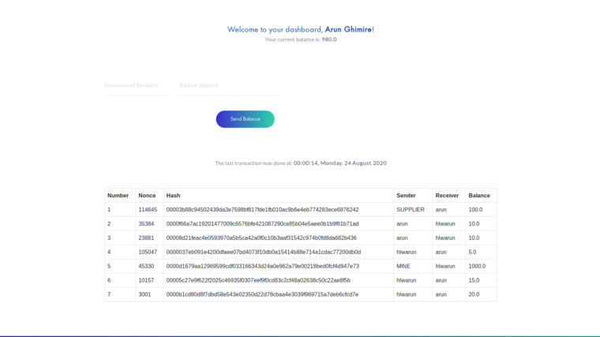

# Aruncoin

### What is Aruncoin?

##### Aruncoin is an innovative payment network and a new kind of money.

Aruncoin is one of the the crypto currencies written in Python using the idea of blockchain.

##### To run this in your device follow the following steps:

    * Download or clone the repository
    * Unzip the downloaded zip file
    * Run pip install -r requirements.txt (for Python 2) OR pip3 install -r requirements.txt (for Python 3)
    * Connect the code with your database
    * Run python app.py (for Python 2) OR python3 app.py  (for Python 3)
